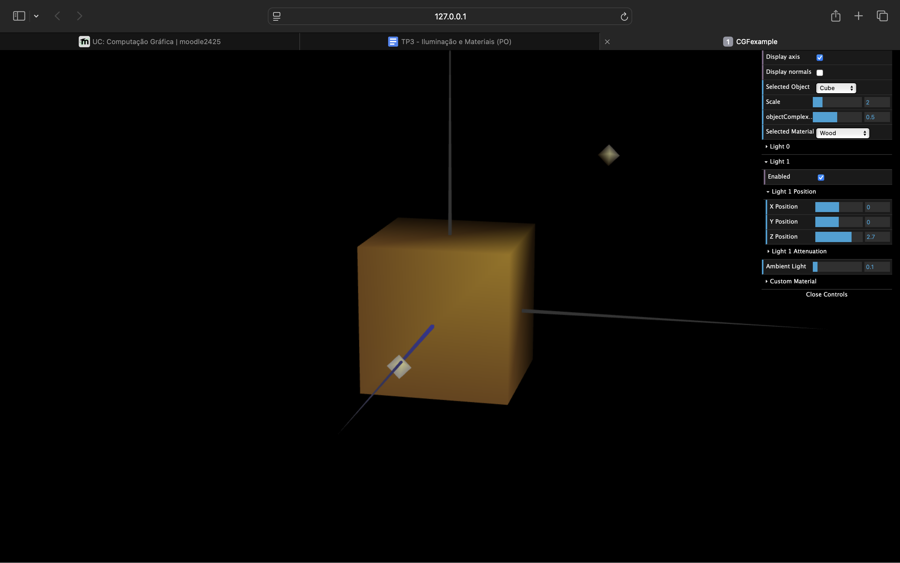
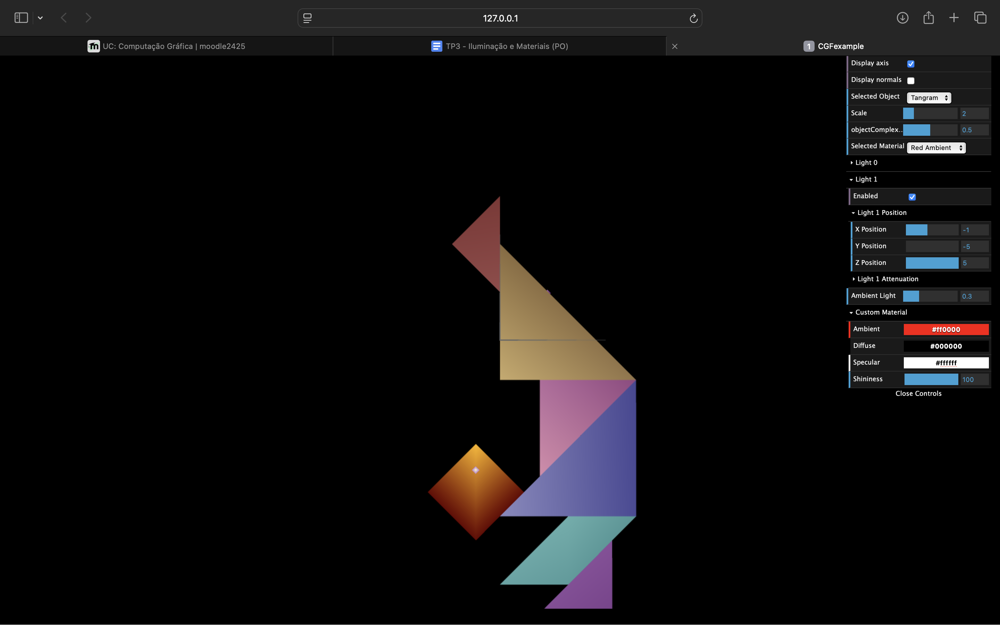
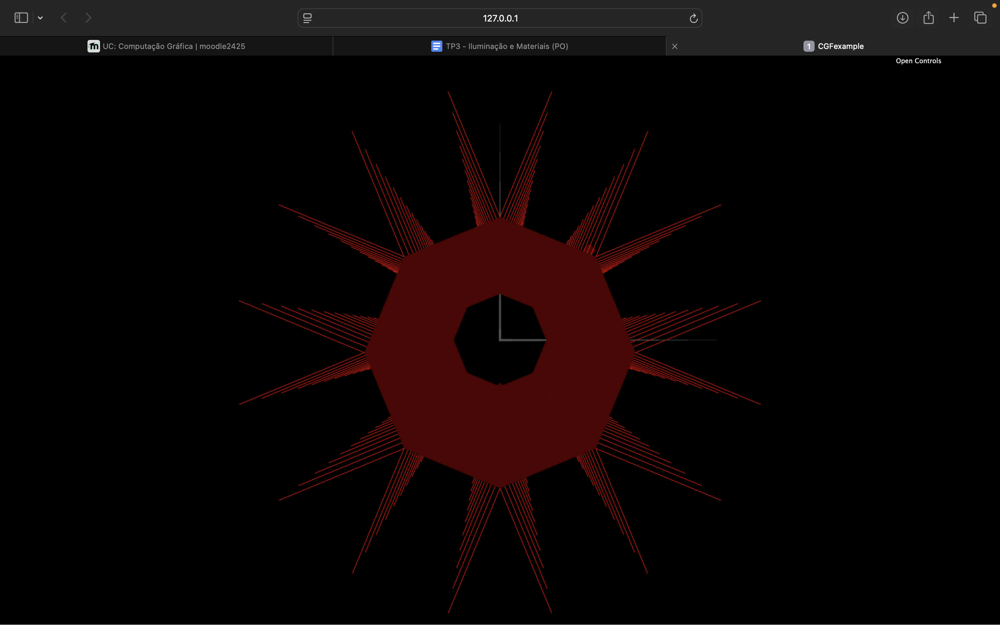
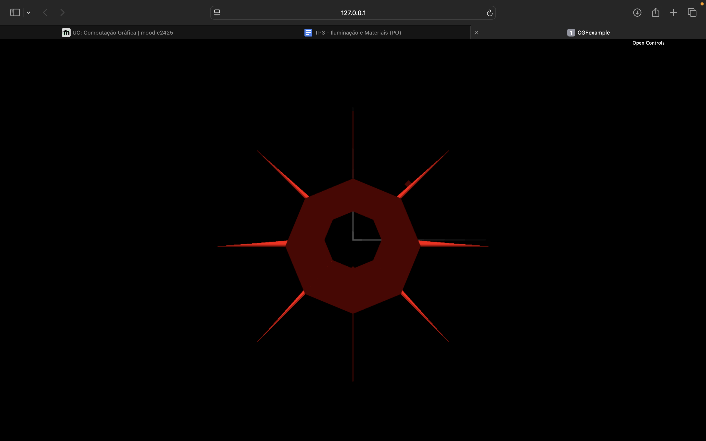

# CG 2024/2025

## Group T11G02

## TP 3 Notes

- Exercise 1 was completed quickly once we figured out how normals were represented and drawn in the code. 
- The main challenge in Exercise 2 was determining the angle between two normals at the same vertex.

- The final exercise was similar to Exercise 2, so no major difficulties were encountered. 

