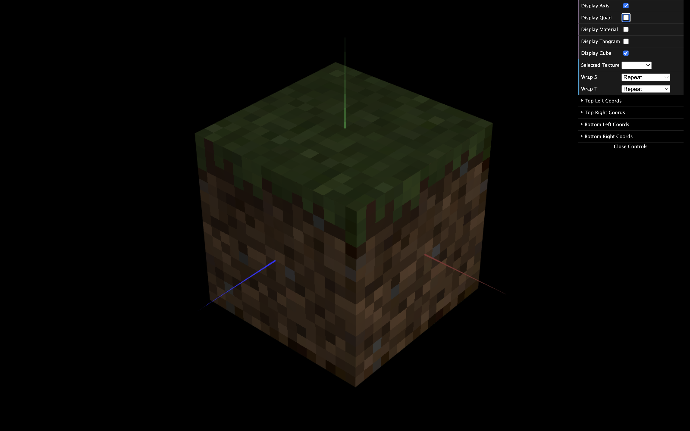

# CG 2024/2025

## Group T11G02

## TP 4 Notes

- Initially, we had difficulty understanding how the CLAMP_TO_EDGE mode for texture wrapping worked, based on the explanation in the exercise sheet. However, after discussing it with the teacher, the concept became clear.

- Once we understood how to correctly apply textures to an object, the exercises were completed quickly.

