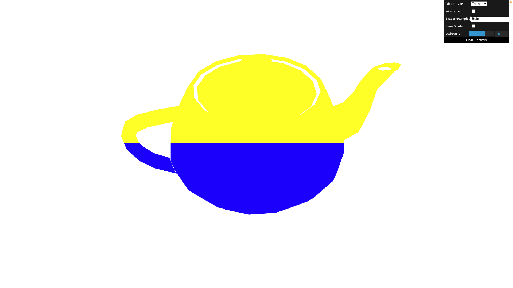
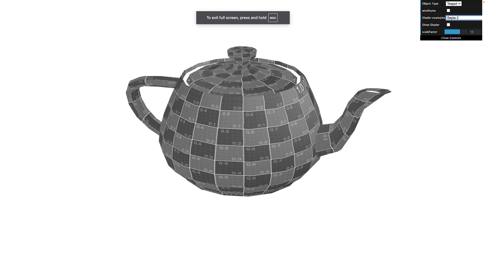
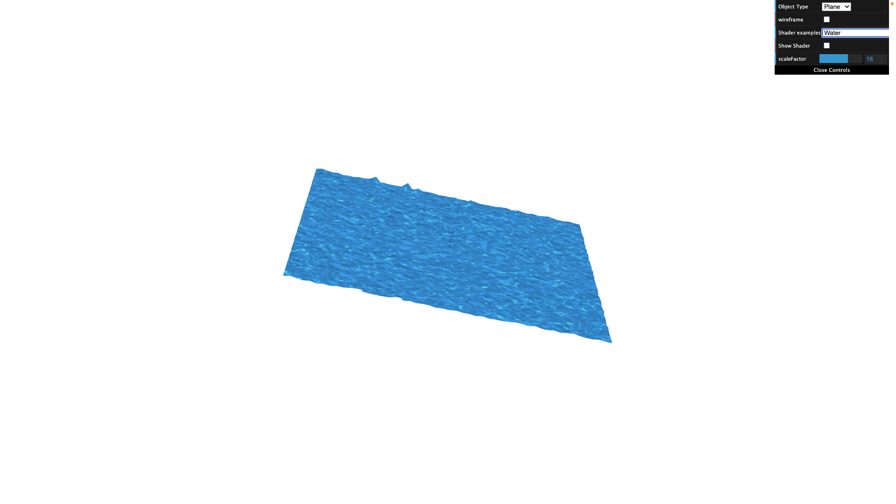

# CG 2024/2025

## Group T11G02

## TP 5 Notes

- It took us some time to fully understand the concepts of vertex and fragment shaders and how to apply them. To get there, we had to watch the provided video and carefully analyze the slides. Additionally, we're unsure if the animation we created in the first exercise aligns with the expected outcome, as no example was provided for reference.

